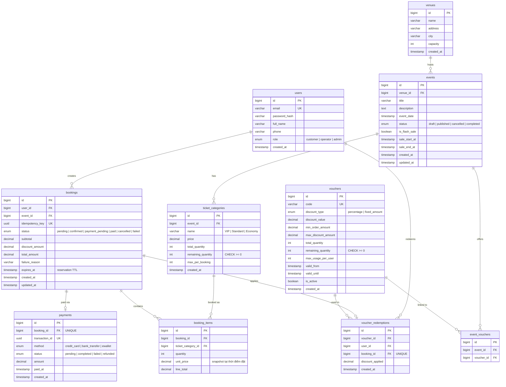

# 🗄️ Database Design

> Thiết kế database cho Concert Ticket Booking Platform.

---

## ER Diagram



---

## Quan hệ giữa các bảng

| Quan hệ | Loại | Giải thích |
|----------|------|-----------|
| `venues` → `events` | 1:N | 1 venue tổ chức nhiều events |
| `events` → `ticket_categories` | 1:N | 1 event có nhiều hạng vé (VIP, Standard, ...) |
| `users` → `bookings` | 1:N | 1 user có nhiều bookings |
| `bookings` → `booking_items` | 1:N | 1 booking chứa nhiều items (có thể mua VIP + Standard) |
| `booking_items` → `ticket_categories` | N:1 | Mỗi item thuộc 1 hạng vé |
| `bookings` → `payments` | 1:1 | 1 booking có 1 payment record |
| `vouchers` → `event_vouchers` | N:M | Voucher có thể áp dụng cho nhiều events |
| `vouchers` → `voucher_redemptions` | 1:N | Tracking mỗi lần voucher được sử dụng |
| `bookings` → `voucher_redemptions` | 1:1 | Mỗi booking chỉ dùng 1 voucher |

---

## Booking Status Flow

```
                        ┌──── (hết hạn reservation)
                        ▼
    ┌─────────┐    ┌──────────┐    ┌─────────────────┐    ┌────────┐
    │ pending │───▶│confirmed │───▶│ payment_pending │───▶│  paid  │
    └─────────┘    └──────────┘    └─────────────────┘    └────────┘
         │              │                   │
         │              │                   │
         ▼              ▼                   ▼
    ┌───────────┐  ┌───────────┐      ┌──────────┐
    │ cancelled │  │ cancelled │      │  failed  │
    └───────────┘  └───────────┘      └──────────┘
```

| Status | Ý nghĩa | Trigger |
|--------|---------|---------|
| `pending` | Vừa tạo booking, chưa xác nhận | User submit booking |
| `confirmed` | Vé đã được reserve (hold) | System xác nhận còn vé |
| `payment_pending` | Chờ thanh toán | User bắt đầu checkout |
| `paid` | Đã thanh toán thành công | Payment gateway callback |
| `cancelled` | Huỷ bởi user hoặc hết hạn | User cancel / TTL expired |
| `failed` | Thanh toán thất bại | Payment gateway reject |

---

## Các Constraints Quan Trọng

### 1. Chống Overselling

```sql
-- remaining_quantity không bao giờ âm
ALTER TABLE ticket_categories
ADD CONSTRAINT chk_remaining_quantity
CHECK (remaining_quantity >= 0);
```

### 2. Chống Duplicate Booking (Idempotency)

```sql
-- Mỗi idempotency_key chỉ tạo 1 booking
ALTER TABLE bookings
ADD CONSTRAINT uq_bookings_idempotency_key
UNIQUE (idempotency_key);
```

### 3. Chống Voucher Abuse

```sql
-- 1 booking chỉ dùng 1 voucher
ALTER TABLE voucher_redemptions
ADD CONSTRAINT uq_voucher_booking
UNIQUE (booking_id);

-- Đếm usage per user để enforce max_usage_per_user
CREATE INDEX idx_voucher_user ON voucher_redemptions(voucher_id, user_id);
```

### 4. Chống Double Payment

```sql
-- 1 booking chỉ có 1 payment record
ALTER TABLE payments
ADD CONSTRAINT uq_payment_booking
UNIQUE (booking_id);
```

---

## Indexes cho Performance

```sql
-- Tìm events đang bán (published, sale đang mở)
CREATE INDEX idx_events_sale ON events(status, sale_start_at, sale_end_at);

-- Tìm bookings của user
CREATE INDEX idx_bookings_user ON bookings(user_id, created_at DESC);

-- Tìm bookings theo event (operation dashboard)
CREATE INDEX idx_bookings_event ON bookings(event_id, status);

-- Tìm booking items theo booking
CREATE INDEX idx_booking_items_booking ON booking_items(booking_id);

-- Tìm expired reservations cần cleanup
CREATE INDEX idx_bookings_expiry ON bookings(status, expires_at)
WHERE status IN ('pending', 'confirmed', 'payment_pending');

-- Voucher lookup by code
CREATE INDEX idx_vouchers_code ON vouchers(code) WHERE is_active = true;
```

---

## Files trong folder này

| File | Mô tả |
|------|-------|
| `schema.sql` | DDL tạo toàn bộ tables, constraints, indexes |
| `seed.sql` | Sample data cho development/testing |
| `README.md` | Tài liệu này |
